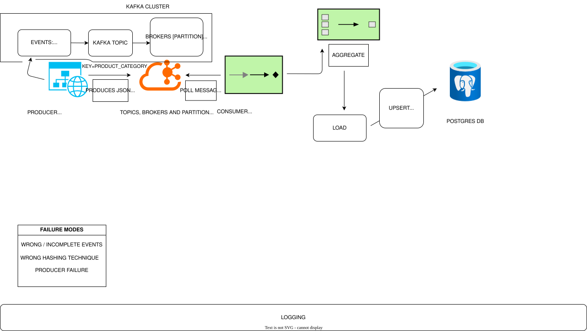

# Kafka Streaming Pipeline — Real-Time Order Metrics

A production-style stream processing pipeline that continuously consumes order events from Apache Kafka, aggregates them across 30-second tumbling windows, and loads real-time metrics into PostgreSQL — processing each event within seconds of it being placed.

---

## Problem Statement

Projects 1, 2, and 3 were all batch pipelines — they collected data over a period of time and processed it all at once on a schedule. By the time those pipelines ran, the data was hours old. A spike in errors, a surge in orders, a drop in revenue — none of these would be visible until the next scheduled run.

This pipeline solves a fundamentally different problem: **processing continuously arriving events in real time without waiting for a batch window to close.**

Three specific problems batch processing cannot solve:

**Unbounded data.** Order events arrive continuously, 24 hours a day. There is no "end of file." A batch pipeline needs a defined dataset to process. A streaming pipeline processes an infinite stream — events arrive forever and are processed the moment they appear.

**Latency.** A daily batch pipeline detects a revenue anomaly up to 24 hours after it starts. A streaming pipeline with 30-second windows detects it within 30 seconds. For operational monitoring, the difference between 24 hours and 30 seconds is the difference between a post-mortem and a live intervention.

**Decoupled producers and consumers.** In batch pipelines, the pipeline owns the full data flow — it reads, transforms, and writes in one sequential process. In streaming, the order service (producer) and the analytics pipeline (consumer) are completely independent. They communicate only through Kafka. Either can be restarted, redeployed, or scaled without affecting the other.

---

## Architecture



**PostgreSQL Table:**
```
order_metrics   ← Gold layer: aggregated window metrics
                  composite PK: window_start × product_category
                  upsert on rerun — idempotent
```

---

## Tech Stack

| Tool | Role | Why |
|---|---|---|
| Apache Kafka | Message broker | Durable, distributed event log — decouples producer from consumer, handles traffic spikes via buffering, enables offset-based crash recovery |
| kafka-python | Kafka client | Python producer and consumer API — manual offset commit control, partition key routing, callback-based delivery confirmation |
| Faker | Synthetic data generation | Realistic order event simulation — names, UUIDs, prices — without a real order service |
| pandas | Windowed aggregation | DataFrame groupby for per-category metric computation across accumulated window events |
| SQLAlchemy | Database ORM | Parameterized upsert queries, connection management, engine abstraction over psycopg2 |
| Alembic | Schema migration | Versioned, auditable schema changes — same pattern as Project 3, metrics schema evolves as monitoring needs grow |
| psycopg2-binary | PostgreSQL driver | Production-grade PostgreSQL adapter for Python |
| python-dotenv | Credentials management | Kafka and database credentials isolated from source code |
| Docker | Infrastructure | Kafka, Zookeeper, and PostgreSQL run as containers — identical environment across machines, no manual installation |

---

## Project Structure

```
kafka_pipeline/
├── alembic/
│   ├── versions/            # migration files
│   └── env.py
├── config/
│   └── config.yaml          # Kafka settings, topic, window duration, categories
├── models/
│   └── tables.py            # SQLAlchemy table definitions
├── src/
│   ├── producer.py          # generates order events, sends to Kafka topic
│   ├── consumer.py          # polls Kafka, maintains window state, flushes metrics
│   ├── aggregator.py        # computes per-category metrics from window events
│   └── load.py              # upserts aggregated metrics to PostgreSQL
├── logs/                    # pipeline run logs
├── docker-compose.yml       # Kafka + Zookeeper + PostgreSQL
├── .env                     # credentials (never committed)
├── .gitignore
└── main.py                  # entry point — creates engine, starts consumer
```

---

## Setup

**Prerequisites:** Python 3.11+, uv, Docker Desktop

**1. Clone the repository**
```bash
git clone <repo-url>
cd kafka_pipeline
```

**2. Start infrastructure**
```bash
docker-compose up -d
```
This starts Kafka, Zookeeper, and PostgreSQL. Wait ~30 seconds for Kafka to finish initializing.

**3. Verify Kafka is ready**
```bash
docker exec kafka_broker kafka-topics \
  --bootstrap-server localhost:9092 --list
```

**4. Install dependencies**
```bash
uv install
```

**5. Configure credentials**
```bash
cp .env.example .env
```

Edit `.env`:
```
DB_USER=pipeline_user
DB_PASSWORD=pipeline_pass
DB_HOST=localhost
DB_PORT=5433
DB_NAME=pipeline_db
```

**6. Run database migrations**
```bash
alembic upgrade head
```

**7. Start the producer** (Terminal 1)
```bash
uv run src/producer.py
```

**8. Start the consumer** (Terminal 2)
```bash
uv run main.py
```

The producer begins generating order events immediately. The consumer starts processing and will flush its first window after 30 seconds.

---

## Verifying Results

**Watch the consumer logs for a successful window flush:**
```
INFO | src.aggregator | Aggregating 62 events across 5 categories
INFO | src.aggregator | Aggregation complete - 5 category rows | total revenue: ...
INFO | src.load       | Upserted 5 metric rows into order_metrics
INFO | src.consumer   | Window flushed - events: 62 | metric rows: 5
```

**Query PostgreSQL directly:**
```bash
docker exec kafka_postgres psql -U pipeline_user -d pipeline_db
```

```sql
-- Metrics per window per category
SELECT window_start, product_category,
       total_orders, total_revenue,
       avg_order_value, top_continent
FROM order_metrics
ORDER BY window_start DESC, product_category;

-- Expected: 5 rows per 30-second window
-- One row per product category: Electronics, Clothing, Food, Books, Sports

-- Revenue trend across windows
SELECT window_start,
       SUM(total_orders)  AS total_orders,
       SUM(total_revenue) AS total_revenue
FROM order_metrics
GROUP BY window_start
ORDER BY window_start DESC;

-- Idempotency test — restart consumer, counts stay the same
SELECT COUNT(*) FROM order_metrics;
-- Rerun consumer, query again — same count, updated values
```

**Producer health** (Terminal 1 logs every 100 events):
```
Producer summary - total sent: 100 | failed: 0 |
distribution: {'Electronics': 21, 'Clothing': 19, 'Food': 22, 'Books': 18, 'Sports': 20}
```
Distribution should be roughly even across categories — confirms partition key routing is working.

---

## Key Design Decisions

See [Documentation](docs/documentation.md) for full reasoning. Summary:

- **`enable_auto_commit=False`** — manual offset commit after successful PostgreSQL write guarantees at-least-once delivery. Auto-commit would commit regardless of whether the database write succeeded.
- **Commit after flush, not before** — if the database write fails, offset is not committed. Consumer restarts from the last committed position. Upsert handles any reprocessed duplicates.
- **30-second tumbling window over sliding window** — fixed non-overlapping windows produce clean, non-duplicated metric rows. Sliding windows produce overlapping aggregations that complicate downstream queries.
- **Product category as partition key** — all events for one category route to the same partition, guaranteeing ordering within a category. Consistent hashing means category distribution is stable.
- **Separate producer and consumer processes** — decoupled via Kafka. Either can be restarted independently without data loss. Producer keeps running during consumer restarts — events accumulate in Kafka and are processed when the consumer resumes.

---

## What I Would Do Differently in Production

**Separate containers** — run producer and consumer as independent Docker Compose services or Kubernetes pods. Each scales independently. Consumer scales horizontally by adding instances — Kafka automatically distributes partitions across the consumer group.

**Multiple consumer instances** — at high volume, add consumer instances to the `order_metrics_consumer` group. With 3 partitions, Kafka can distribute one partition per consumer instance — tripling throughput without code changes.

**Schema Registry** — enforce event schema at the Kafka level using Confluent Schema Registry. Producers that emit malformed events are rejected before they reach the consumer. Eliminates deserialization errors in the consumer.

**Dead letter topic** — instead of logging and skipping malformed events, route them to a `orders.dlq` topic for separate investigation and reprocessing. Same principle as the dead letter queue in Projects 1 and 3.

**Secrets management** — replace `.env` files with AWS Secrets Manager or HashiCorp Vault. Credentials rotate automatically and are never stored on developer machines or in environment files.

**Monitoring** — expose consumer lag metrics to Prometheus. Consumer lag — the difference between the latest offset in a partition and the consumer's current position — is the primary health metric for a Kafka consumer. Rising lag means the consumer is falling behind and needs scaling.